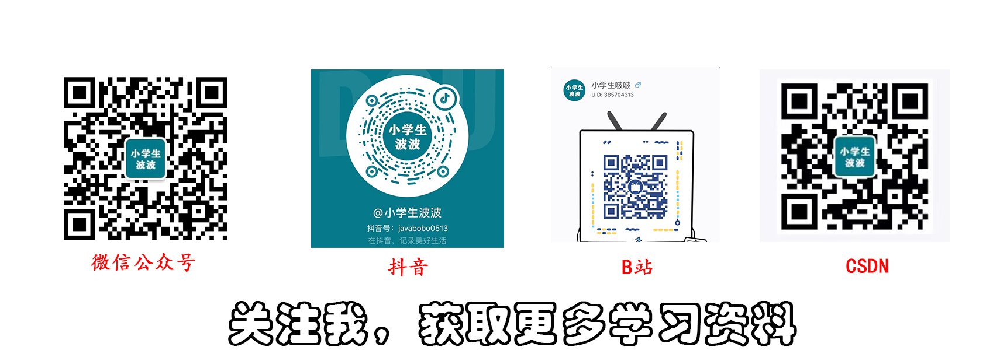
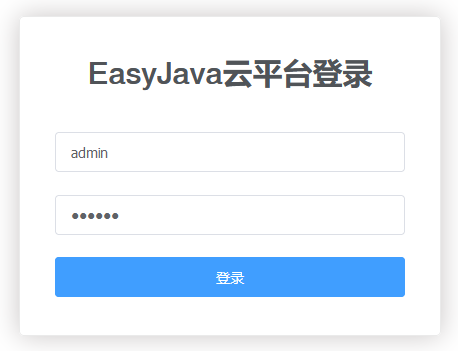
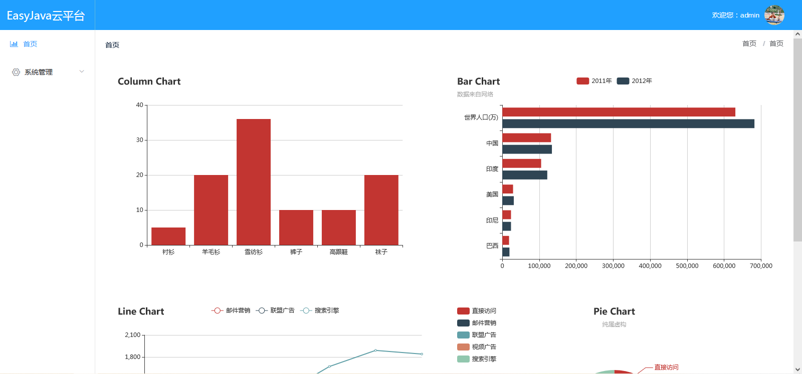
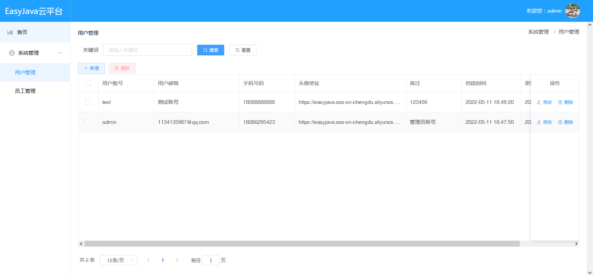
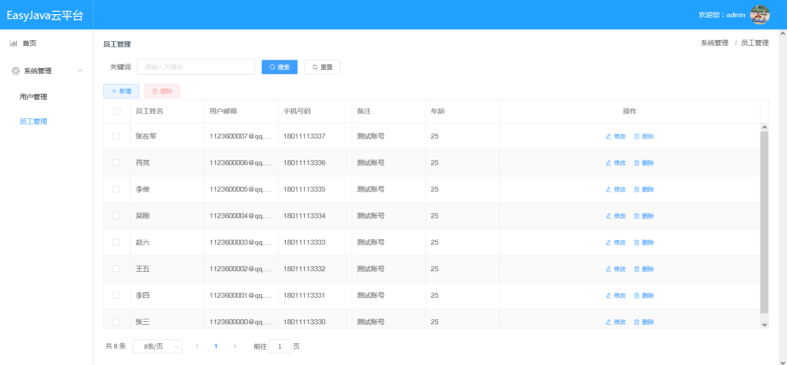

# EasyJavaTemplate

## 1、技术栈

1. 后台：SpringBoot、MyBatisPlus、Redis、MySQL
2. 前端：VUE、ElementUI（前端页面采用静态路由）

> 特点：

本项目最大的特点就是，能够为大家提供快速开发脚手架，后台的代码生成工具类，可以一键生成后台和前台所有代码，包括：controller、mapper、domain、service、mapper.xml、vue页面等，**实战起来开发效率非常高**

## 2、后台如何运行

1. 将SQL脚本在数据库中执行一下
2. 修改application.yml中连接数据库/Redis等服务器的参数，确保可以连接上就可以了
3. 然后运行启动类即可

## 3、前台如何运行

1. npm install：安装相关依赖
2. npm run dev：启动项目

> 注意点：

config/index.js中的assetsPublicPath的值需要根据实际情况修改：

1. IDEA运行时这样配置：assetsPublicPath: '/'
2. build打包时这样配置：assetsPublicPath: './'

## 4、后续

大家想学什么技术栈，想做什么功能的，可以留言，我会尽快更新进去，希望大家能有所收获

## 5、登录

运行成功登录页面：

账号：admin

密码：123456

登录成功首页：

目前里面只有两个菜单：用户管理和员工管理：

